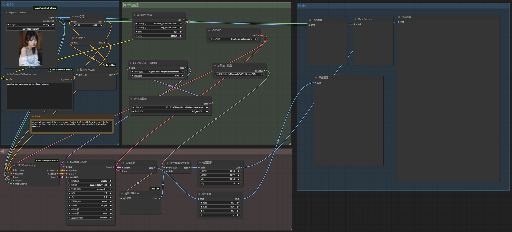

This repository provides the official ComfyUI workflow for [ICEdit](https://github.com/River-Zhang/ICEdit).
# 🎨ComfyUI Workflow


In addition to directly loading images using the DiptyCreate node, you can also input images that have been processed by other ComfyUI nodes. In this case, the image loaded by the DiptyCreate node will be ignored. However, the DiptyCreate node still needs to load an image to prevent errors caused by the absence of a loaded image.For details, please refer to this [issue](https://github.com/hayd-zju/ICEdit-ComfyUI-official/issues/7).


## 🎆 News 

- **[2025/5/14]** 🔥 With the help of the [official comfy-org](https://www.comfy.org/zh-cn/), we have integrated our ComfyUI nodes into [Comfy Registry](https://registry.comfy.org/nodes/ICEdit)! 
- **[2025/5/9]** 🔥 We have released our **[official ComfyUI workflow](https://github.com/hayd-zju/ICEdit-ComfyUI-official/tree/main)**! 🚀 Check the repository and have a try!

## Installation

We offer two methods for installing ICEdit-ComfyUI. You can choose the one you prefer.

### Prerequisites

Please first install [ComfyUI](https://github.com/comfyanonymous/ComfyUI/tree/master) with the following commands:

 ```shell
	git clone https://github.com/comfyanonymous/ComfyUI.git
	cd ComfyUI
	pip install -r requirements.txt
 ```

In addition, you need to install [ComfyUI_essentials](https://github.com/cubiq/ComfyUI_essentials) and [ComfyUI-Easy-Use](https://github.com/yolain/ComfyUI-Easy-Use).

 ### ComfyUI-Manager

 1. Install [ComfyUI-Manager](https://github.com/ltdrdata/ComfyUI-Manager) with the following commands:

 ```shell
	cd custom_nodes
	git clone https://github.com/ltdrdata/ComfyUI-Manager comfyui-manager
 ```

 2. Launch ComfyUI:

 ```shell
	cd ..	# Make sure you are in the ComfyUI root directory
	python main.py
 ```
 3. Open the `ComfyUI Manager`, select `Install via Git URL`, input the URL:

 ```shell
	https://github.com/hayd-zju/ICEdit-ComfyUI-official.git`
 ```

 4. Then install it and just wait a minute.
 ### Manual Installation
  1. Clone this repository into the `custom_nodes` directory inside ComfyUI:

 ```shell
	cd custom_nodes
	git clone https://github.com/hayd-zju/ICEdit-ComfyUI-official.git
 ```
  2. Launch ComfyUI:

 ```shell
	cd ..	# Make sure you are in the ComfyUI root directory
	python main.py
 ```

 ## Usage
 1. Download Required Models: If you can connect to Huggingface, you don't need to download the weights. Otherwise, you need to download the weights to local.

	- [Flux.1-fill-dev](https://huggingface.co/black-forest-labs/flux.1-fill-dev).
	- [ICEdit-normal-LoRA](https://huggingface.co/RiverZ/normal-lora/tree/main).

 2. Use our workflow example in [example_workflow](https://github.com/hayd-zju/ICEdit-ComfyUI-official/tree/main/example_workflow): You can directly drag the JSON file onto the ComfyUI interface.
